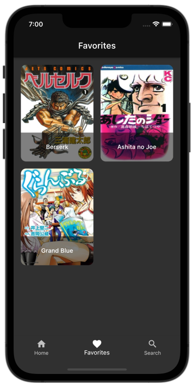

  <h1 align="center">Manga App</h1>
  

   You can list manga, view manga details, add manga to your favorites, and search any manga using the Manga App.
  

 
## Built With

- [Flutter](https://flutter.dev/)
- [Dart](https://dart.dev/)
- [Jikan API v4](https://docs.api.jikan.moe/)

## Preview

    
    
    
    

## Architecture

This app is developed with [MVC](https://en.wikipedia.org/wiki/Model%E2%80%93view%E2%80%93controller) pattern.

## Packages

- State management
  - [BLoC](https://pub.dev/packages/flutter_bloc)
- Cache
  - [Hive](https://pub.dev/packages/hive)
  - [Cached Network Image](https://pub.dev/packages/cached_network_image)
- Network
  - [dio](https://pub.dev/packages/dio)

